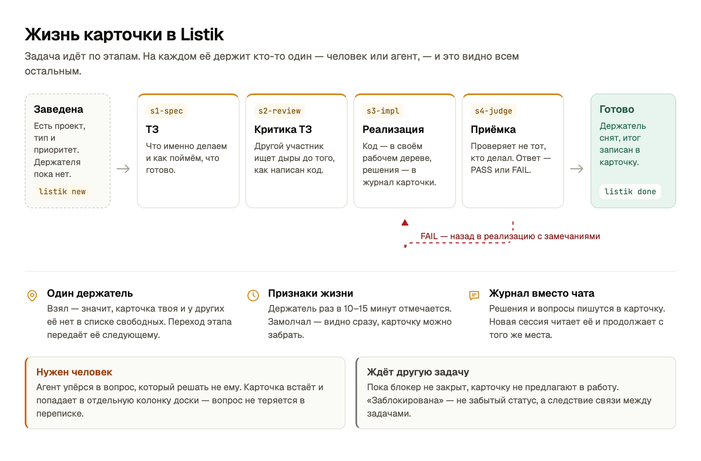
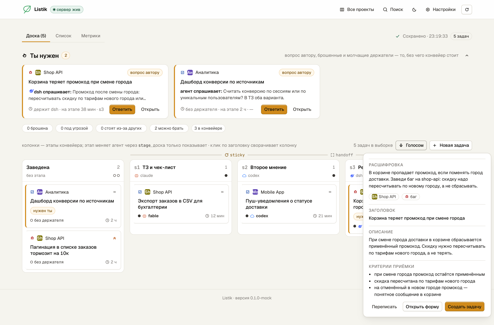
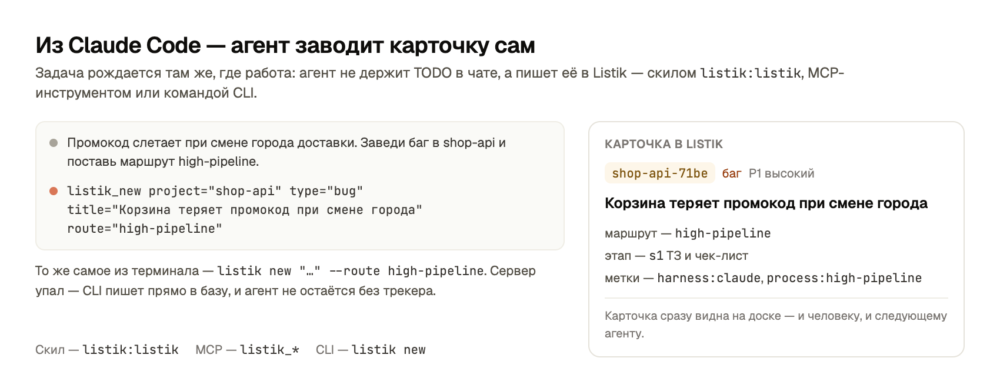
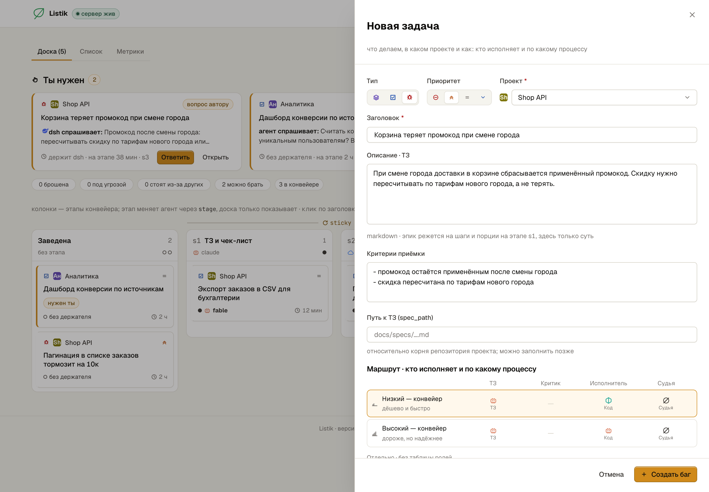
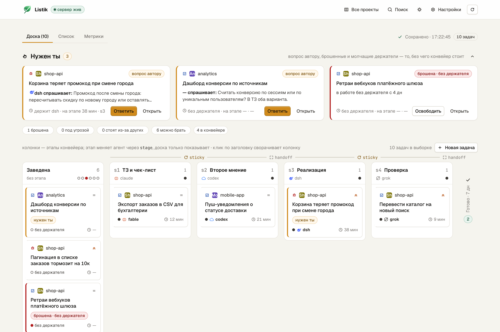
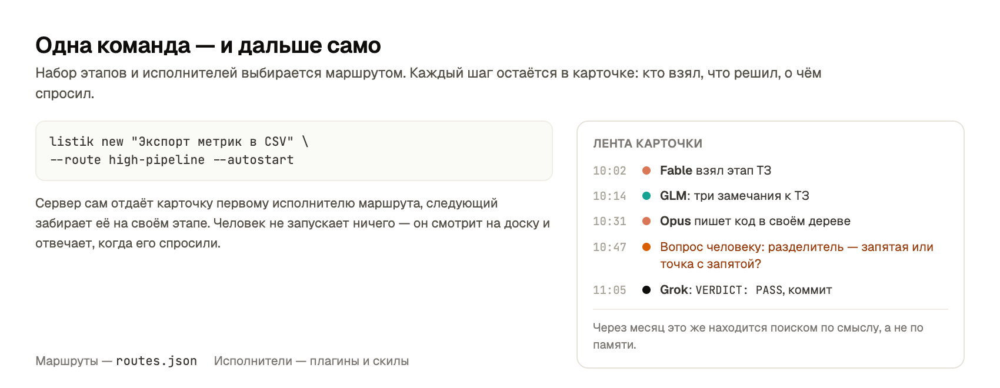

# Listik

**Одна очередь задач на все проекты — для вас и для ваших агентов.**
Claude Code, Codex, DeepSeek и Grok работают в ней вместе, а вы видите всё, что они делают,
в браузере, а не в тридцати вкладках с чатами.

Один сервер, одна база SQLite, один API (HTTP и MCP). Задачи, журнал работы, долговременная
память и гибридный поиск по всей истории — в одном месте. Чистый Python 3.11+, без зависимостей.

```sh
curl -fsSL https://github.com/dmitry-fomin/listik/releases/latest/download/install.sh | sh
```

---

## Проблема, которую он решает

Агентская работа теряется между сессиями. Два агента берут одну и ту же задачу. Вопрос человеку
тонет в чате, а через неделю никто не помнит, почему сделали именно так.

В Listik у задачи всегда видно, **кто её держит**, **на каком она этапе**, **жив ли держатель**,
**чего она ждёт** и **что уже решено**. Любая новая сессия восстанавливает контекст из карточки,
а не из переписки.



## Чем он лучше

### Всё в одном месте

Задачи, журнал работы по каждой карточке, долговременная память и поиск живут в одной базе
и отдаются одним API. Не нужно склеивать трекер, вики и заметки: агент пишет решение в карточку,
человек находит его поиском через месяц.

```sh
listik search "как решали X"      # задачи, комментарии, документы
listik remember "факт" -p <проект>
listik memory "про что-то"
```

Поиск гибридный: полнотекстовый FTS5 плюс векторный (Ollama + `bge-m3`). Ollama не запущена —
поиск молча остаётся лексическим, ничего не ломается.

### Завести задачу — тремя способами

**Голосом.** Кнопка «Голосом» на доске (и клавиша `V`): расскажите задачу словами — Listik
расшифрует запись и соберёт черновик с проектом, типом, заголовком, описанием и критериями
приёмки. Дальше либо «Создать задачу», либо «Открыть форму» и поправить руками. Кнопка
появляется, когда в `config.toml` прописаны ключи расшифровки (`[deepgram]`) и помощника
(`[assistant]`), модель роя (`[swarm]`, см. docs/API.md).



**Из Claude Code.** Агент заводит карточку сам, по ходу работы: скилом `listik:listik`,
MCP-инструментами `listik_*` или командой `listik new`. Найденная попутно проблема становится
не строчкой TODO в чате, а карточкой с маршрутом, которую увидят и человек, и следующий агент.



**Формой на доске.** Кнопка «Новая задача» открывает форму: тип, приоритет, проект, заголовок,
описание, критерии приёмки, путь к ТЗ и маршрут — кто исполняет и по какому процессу. Галочка
«Автостарт» тут же отдаёт карточку первому исполнителю маршрута.



### Смотреть и искать может человек



`listik token` даёт ссылку на доску в браузере. Колонки этапов, отдельная колонка «Ты нужен»
для вопросов к вам, список с фильтрами и массовой правкой, метрики. По каждой карточке — лента
событий: кто взял, когда отметился, что решил, о чём спросил, чем кончилось. Всё то же самое
доступно из CLI с `--json` и из MCP — но человеку не обязательно жить в консоли.

Агенту не нужна вся карточка ради одного поля: `listik show <id> --fields launch_route,labels`
(повторяемо или через запятую) отдаёт только перечисленные поля — фильтр делает сервер или
локальная база (`--local`), неизвестное поле — ошибка `bad_argument` с перечнем доступных.
То же умеют `GET /api/tasks/{id}?fields=a,b` и параметр `fields` в MCP-инструменте `listik_show`
(подробности — docs/API.md).

### Конвейеры и скилы — встроенные

Задача идёт не «как получится», а по маршруту: набор этапов и исполнителей, записанный
в таблице `routes` (при установке она один раз наполняется файлом поставки `routes.json`).
Исполнителей на каждый этап вы выбираете сами — хоть четыре разные модели,
хоть одна и та же на все четыре:

| Маршрут | ТЗ | Критика | Реализация | Приёмка | Когда берут |
|---|---|---|---|---|---|
| `xhigh-pipeline` | Fable | GLM | Codex | Grok | ошибка дороже прогона |
| `high-pipeline` | Fable | GLM | Opus | Grok | расклад по умолчанию |
| `inherit-pipeline` | Fable | Opus | Sonnet | Opus | всё внутри Claude, наружу ничего не уходит |
| `nano-pipeline` | — | — | Codex | Grok | короткая задача: сделать и принять |

Полный список — `listik routes`, `GET /api/routes` или
доска; там же собирается свой набор. Исполнители подключаются плагинами Claude Code,
репозиторий сам является маркетплейсом:

```
/plugin marketplace add dmitry-fomin/listik
/plugin install listik@listik             # протокол задач: скил listik:listik
/plugin install feature-pipeline@listik   # пресеты конвейера и агенты pipeline-*
/plugin install dsh@listik                # DeepSeek Harness
/plugin install codex@listik              # OpenAI Codex CLI
/plugin install pi@listik                 # pi CLI (GLM 5.3 Flash, DeepSeek v4.1 Flash)
/plugin install second-opinion@listik     # независимая критика ТЗ
```



Чтобы довести волну задач проекта до конца без ручного запуска каждой по очереди, поднимите
рой `listik-swarm` — см. «Рой: `listik-swarm`» в [docs/usage.md](docs/usage.md).

### Агент не остаётся без трекера

CLI работает и без сервера — идёт в базу напрямую, поэтому упавший сервер не блокирует агента.
`--json` есть у каждой команды, ошибка приходит объектом `{"error": {"code", "message", "hint"}}`
с подсказкой, что делать. MCP-инструменты `listik_*` работают и локально, и через HTTPS
на удалённый сервер. Вызов из каталога проекта (`ready`, `list`, `board`, `stats`, `search`,
`blocked`, `new`, `waves`) показывает очередь этого проекта; `--project all` снимает фильтр,
а `LISTIK_PROJECT` задаёт проект явно.

### Чем это отличается от beads

beads — отличная идея и прямой предок этого проекта: та же очередь задач, живущая в консоли
и в гите. Агенту там удобно, человеку — нет: чтобы посмотреть, что происходит, нужно
выполнять команды, а история работы остаётся набором коммитов.

Listik берёт ту же модель и добавляет то, чего не хватало людям: доску в браузере, ленту
действий по каждой карточке, гибридный поиск и память по всей истории, встроенные конвейеры
со скилами. Старые проекты на beads переносятся разово — `listik import-from-bd`.

---

## Установка и запуск

Нужно: Python 3.11+ (только стандартная библиотека). Для доски — Node.js. Для векторного поиска —
[Ollama](https://ollama.com) с моделью `bge-m3` (необязательно: без неё поиск лексический).

### Одной строкой

```sh
curl -fsSL https://github.com/dmitry-fomin/listik/releases/latest/download/install.sh | sh
```

Работает после публикации релиза (`scripts/release.sh --publish`). Код ставится в
`~/.listik/app/<версия>`, обёртка `listik` — в `~/.local/bin`, данные — в `~/.listik`.
Повторный запуск обновляет версию, данные не трогает. Установщик по ходу предлагает автозапуск,
MCP и плагины Claude.

Если установлен Codex, установщик проверяет его `config.toml` (`$CODEX_HOME/config.toml`,
по умолчанию `~/.codex/config.toml`): нет секции `[sandbox_workspace_write]` с
`network_access = true` — предложит дописать, сохранив рядом копию конфига
(`config.toml.bak-<время>`). При отказе — предупреждение: без этой настройки Codex в режиме
записи не достучится до сервера Listik (127.0.0.1) и не сможет брать задачи, слать heartbeat
и писать журнал. Ответ задаёт флаг `--codex-network yes|no|ask` (по умолчанию `ask` — вопрос
в `/dev/tty`); `--yes` этот вопрос не закрывает — конфиг Codex правится только явным
`--codex-network yes`.

Все флаги (`--version`, `--archive`, `--home`, `--service`, `--mcp`, `--plugins`,
`--codex-network`, `--yes`, …) — `install.sh --help`.

### Из исходников

```sh
git clone https://github.com/dmitry-fomin/listik.git && cd listik
(cd web && npm install && npm run build)   # собрать доску

listik serve --daemon   # сервер и доска на http://127.0.0.1:8787
listik token            # ссылка на доску с токеном
listik status           # сервер, база, поиск (--json)
listik stop
```

- База и `config.toml` (с токеном) создаются сами при первом `serve`/`init`.
- Каталог данных задаёт `LISTIK_HOME` (по умолчанию — корень репозитория); `LISTIK_DB`,
  `LISTIK_CONFIG`, `LISTIK_LOG` переопределяют отдельные пути.
- Векторы: `ollama serve` + `ollama pull bge-m3`; сервер досчитывает их раз в 45 с.
  Отключить — `serve --no-embed`.
- CLI работает и без сервера — идёт в базу напрямую. `--json` есть у всех команд; ошибка
  с `--json` приходит в stdout объектом `{"error": {"code", "message", "hint"}}`.

### Автозапуск

```sh
listik service install     # launchd (macOS) или systemd --user (Linux)
listik service install --stop   # сначала остановить сервер, запущенный вручную
listik service status
listik service uninstall   # данные не трогает
```

На macOS launchd-плист хранится в `~/Library/LaunchAgents/listik.server.plist`, на Linux
systemd-юнит — в `~/.config/systemd/user/listik.service`. Лог сервиса — `logs/service.log`;
юнит сохраняет PATH установки и добавляет стандартные каталоги пользовательских CLI
(`~/.local/bin`, `~/bin`, Homebrew/Linuxbrew), чтобы автостарт находил харнессы без shell-профиля;
`uninstall --no-load` удаляет файл, но оставляет уже загруженный сервис работать до ручной выгрузки.
Если сервер уже поднят вручную (`listik serve --daemon`), `install` откажет — чтобы не плодить
второй процесс на том же порту; `--stop` снимает запущенный сервер и ставит сервис на его место
(так делает `install.sh` при обновлении).

### Резервные копии

Сервер держит базу в WAL — копировать её через `cp`/`mv`/`rm` **нельзя**. Только так:

```sh
listik backup                  # согласованная копия рядом с базой (сервер не останавливать)
listik restore --stop <копия>  # остановить сервер и вернуть базу; текущая сохранится в .bak-pre-restore-*
```

---

## Дальше

- [docs/usage.md](docs/usage.md) — как устроена работа: протокол, конвейер, зависимости,
  серверный режим, доска, поиск, подключение агентов, справочник команд.
- [docs/API.md](docs/API.md) — контракт данных и эндпоинтов, источник истины по поведению.
- [AGENTS.md](AGENTS.md) — протокол работы агента с задачами.
- [CLAUDE.md](CLAUDE.md) — устройство кода.
- [docs/development.md](docs/development.md) — тесты, сборка доски, миграции Alembic.
