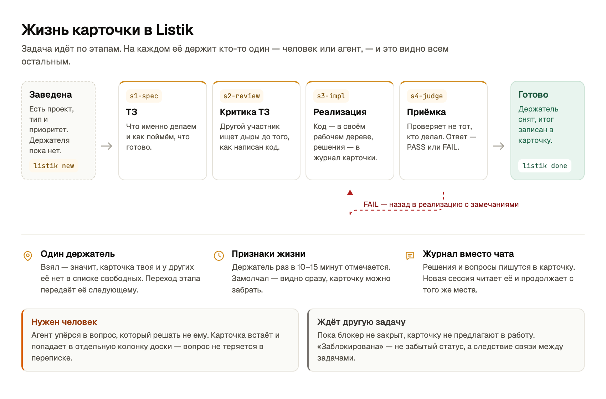
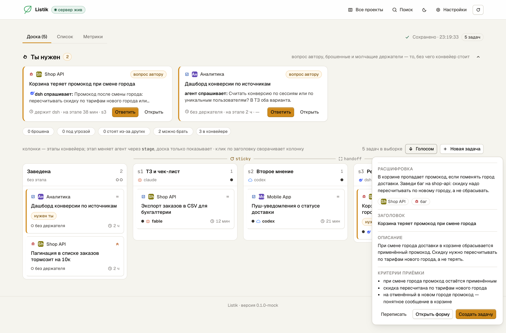
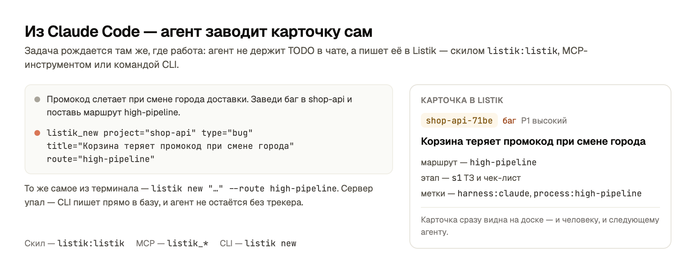
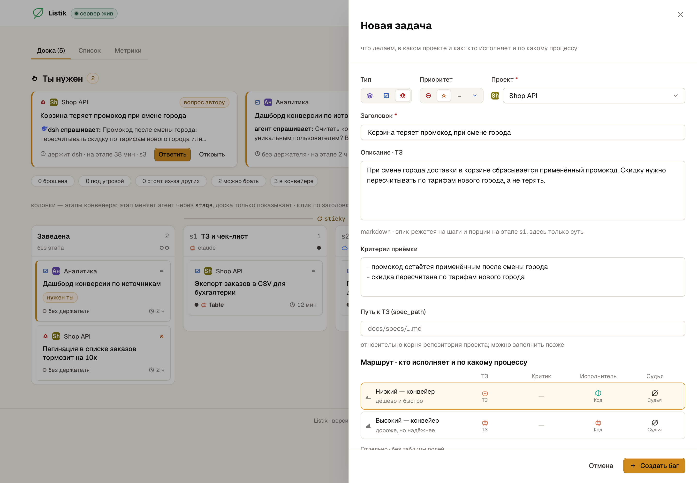
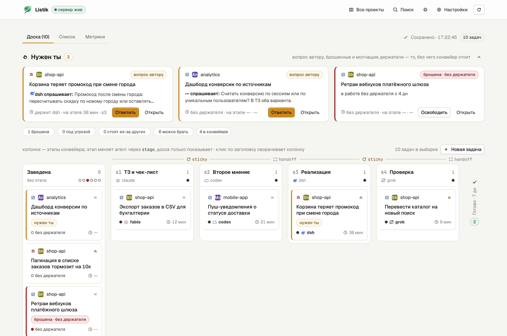
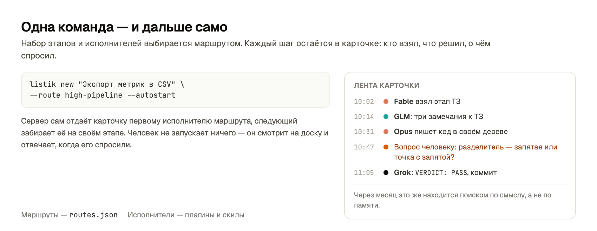

# Listik

**Одна очередь задач на все проекты — для вас и для ваших агентов.**
Claude Code, Codex, DeepSeek и Grok работают в ней вместе, а вы видите всё, что они делают,
в браузере, а не в тридцати вкладках с чатами.

Один сервер, одна база SQLite, один API (HTTP и MCP). Задачи, журнал работы, долговременная
память и гибридный поиск по всей истории — в одном месте. Чистый Python 3.11+, без зависимостей.

```sh
curl -fsSL https://github.com/dmitry-fomin/listik/releases/latest/download/install.sh | sh
```

---

## Проблема, которую он решает

Агентская работа теряется между сессиями. Два агента берут одну и ту же задачу. Вопрос человеку
тонет в чате, а через неделю никто не помнит, почему сделали именно так.

В Listik у задачи всегда видно, **кто её держит**, **на каком она этапе**, **жив ли держатель**,
**чего она ждёт** и **что уже решено**. Любая новая сессия восстанавливает контекст из карточки,
а не из переписки.



## Чем он лучше

### Всё в одном месте

Задачи, журнал работы по каждой карточке, долговременная память и поиск живут в одной базе
и отдаются одним API. Не нужно склеивать трекер, вики и заметки: агент пишет решение в карточку,
человек находит его поиском через месяц.

```sh
listik search "как решали X"      # задачи, комментарии, документы
listik remember "факт" -p <проект>
listik memory "про что-то"
```

Поиск гибридный: полнотекстовый FTS5 плюс векторный (Ollama + `bge-m3`). Ollama не запущена —
поиск молча остаётся лексическим, ничего не ломается.

### Завести задачу — тремя способами

**Голосом.** Кнопка «Голосом» на доске (и клавиша `V`): расскажите задачу словами — Listik
расшифрует запись и соберёт черновик с проектом, типом, заголовком, описанием и критериями
приёмки. Дальше либо «Создать задачу», либо «Открыть форму» и поправить руками. Кнопка
появляется, когда в `config.toml` прописаны ключи расшифровки (`[deepgram]`) и помощника
(`[assistant]`), модель роя (`[swarm]`, см. docs/API.md).



**Из Claude Code.** Агент заводит карточку сам, по ходу работы: скилом `listik:listik`,
MCP-инструментами `listik_*` или командой `listik new`. Найденная попутно проблема становится
не строчкой TODO в чате, а карточкой с маршрутом, которую увидят и человек, и следующий агент.



**Формой на доске.** Кнопка «Новая задача» открывает форму: тип, приоритет, проект, заголовок,
описание, критерии приёмки, путь к ТЗ и маршрут — кто исполняет и по какому процессу.
Карточку с маршрутом берёт рой.



### Смотреть и искать может человек



`listik token` даёт ссылку на доску в браузере. Колонки этапов, отдельная колонка «Ты нужен»
для вопросов к вам, список с фильтрами и массовой правкой, метрики. По каждой карточке — лента
событий: кто взял, когда отметился, что решил, о чём спросил, чем кончилось. Всё то же самое
доступно из CLI с `--json` и из MCP — но человеку не обязательно жить в консоли.

Агенту не нужна вся карточка ради одного поля: `listik show <id> --fields launch_route,labels`
(повторяемо или через запятую) отдаёт только перечисленные поля — фильтр делает сервер или
локальная база (`--local`), неизвестное поле — ошибка `bad_argument` с перечнем доступных.
То же умеют `GET /api/tasks/{id}?fields=a,b` и параметр `fields` в MCP-инструменте `listik_show`
(подробности — docs/API.md).

### Конвейеры и скилы — встроенные

Задача идёт не «как получится», а по маршруту: набор этапов и исполнителей, записанный
в таблице `routes` (при установке она один раз наполняется файлом поставки `routes.json`).
Исполнителей на каждый этап вы выбираете сами — хоть четыре разные модели,
хоть одна и та же на все четыре:

| Маршрут | Скил | ТЗ | Критика | Реализация | Приёмка | Когда берут |
|---|---|---|---|---|---|---|
| `full-xhigh` | `pipeline-full:xhigh` | Opus xhigh | Sonnet + DeepSeek + SWE-2 | Opus xhigh | линзы GLM → Grok xhigh | ошибка дороже прогона |
| `full-cross` | `pipeline-full:cross` | Devin | DeepSeek + Sonnet | GLM в pi | Grok | автор ТЗ и код — разные вендоры |
| `full-high` | `pipeline-full:high` | Opus high | Sonnet + DeepSeek + SWE-2 | Opus high | линзы GLM → Grok xhigh | расклад по умолчанию |
| `full-medium` | `pipeline-full:medium` | Opus medium | Sonnet + DeepSeek | Opus medium | Grok high | работа понятная |
| `cc-sol` | `pipeline-cc:sol` | Opus medium | Sonnet + Sol medium (Codex) | Opus medium | Sol high (Codex) | проверяющие от OpenAI вместо Grok |
| `full-low` | `pipeline-full:low` | Opus low | DeepSeek + GLM | devin SWE-2 max | Grok high | код вне квоты Max |
| `full-xlow` | `pipeline-full:xlow` | — | — | devin SWE-2 max | Grok high | один прогон с приёмкой |
| `full-nano` | `pipeline-full:nano` | — | — | devin SWE-2 high | GLM в pi | короткая задача: сделать и принять |
| `cc-xhigh`, `cc-high`, `cc-medium`, `cc-low`, `cc-xlow`, `cc-nano` | `pipeline-cc:<уровень>` | по уровню | по уровню | Opus | Astra (Codex) | линейка Claude + Codex — см. `plugins/pipeline-cc/README.md` |
| `claude-high` | `pipeline-claude:high` | Opus high | Sonnet high + Opus high | Opus high | линзы Sonnet → Sonnet high | только Claude: внешних денег ноль |
| `claude-xhigh` | `pipeline-claude:xhigh` | Opus xhigh | Sonnet xhigh + Opus xhigh | Opus xhigh | линзы Sonnet → Sonnet xhigh | только Claude: внешних денег ноль |
| `claude-opus` | `pipeline-claude:opus` | — | — | Opus medium | — | без ТЗ, критики и приёмки |

Схема каждого пресета — в README его плагина: [pipeline-full](plugins/pipeline-full/README.md),
[pipeline-cc](plugins/pipeline-cc/README.md), [pipeline-claude](plugins/pipeline-claude/README.md).

Привести таблицу к `routes.json` установленной копии — `listik routes --reimport`: пайплайны
из файла перезаписываются (их правки на доске пропадают), пайплайны-скилы не из файла удаляются,
а маршруты роя и пайплайны роя, которых нет в файле, остаются и встают после
записей файла. До записи таблица снимается в `<каталог данных>/routes.bak-<UTC>.json`; вернуть
её — `listik routes --reimport --from <копия>` (`--from` берёт любой файл в формате `routes.json`).
Отчёт `--json`: `imported`, `source`, `kept`, `removed`, `backup`, `orphans`.
Скрыть маршруты — `listik routes --hide <ключ> …`; вернуть видимость — на доске или
`PATCH /api/routes/{key}`.
Полный список — `listik routes`, `GET /api/routes` или
доска; там же собирается свой набор. Исполнители подключаются плагинами Claude Code,
репозиторий сам является маркетплейсом:

```
/plugin marketplace add dmitry-fomin/listik
/plugin install listik@listik             # протокол задач: скил listik:listik
/plugin install pipeline-core@listik      # ядро конвейера, агенты pipeline-*, хук; ставится зависимостью пресетов
/plugin install pipeline-full@listik      # пресеты конвейера на всех харнессах
/plugin install pipeline-cc@listik        # пресеты конвейера на Claude + Codex
/plugin install pipeline-claude@listik    # пресеты конвейера только на Claude
/plugin install dsh@listik                # DeepSeek Harness
/plugin install codex@listik              # OpenAI Codex CLI
/plugin install pi@listik                 # pi CLI (GLM 5.3 Flash, DeepSeek v4.1 Flash); критика ТЗ в конвейерах
/plugin install second-opinion@listik     # второе мнение другой LLM
/plugin install devin@listik              # devin (SWE-2)
/plugin install opencode@listik           # opencode CLI
# обновить уже стоящие: /plugin marketplace update listik, затем /plugin update <имя>@listik
```



Чтобы довести волну задач проекта до конца без ручного запуска каждой по очереди, поднимите
рой `listik-swarm` — см. «Рой: `listik-swarm`» в [docs/usage.md](docs/usage.md).
Если в `<каталог данных>/swarm.json` для проекта не задан ключ `integration`, рой открывает
стоп-карточку `swarm:halt` и не сливает и не запускает задачи проекта (пустой список `[]`
означает «тестов нет») — подробности в [docs/usage.md](docs/usage.md).

### Агент не остаётся без трекера

С локальным Listik CLI работает и без сервера — идёт в базу напрямую, поэтому упавший сервер
не блокирует агента (с общим сервером CLI так не делает — см. «Общий Listik для команды»).
`--json` есть у каждой команды, ошибка приходит объектом `{"error": {"code", "message", "hint"}}`
с подсказкой, что делать. MCP-инструменты `listik_*` работают и локально, и через HTTPS
на удалённый сервер. Вызов из каталога проекта (`ready`, `list`, `board`, `stats`, `search`,
`blocked`, `new`, `waves`) показывает очередь этого проекта; `--project all` снимает фильтр,
а `LISTIK_PROJECT` задаёт проект явно.

### Общий Listik для команды

Один Listik на несколько человек: задачи живут на общем сервере, а у каждого — свой CLI и
свои агенты.

1. **Сервер.** В его `config.toml` — `[server] mode = "server"`, список людей `users` и общий
   `[auth] token`. Сам сервер остаётся на `127.0.0.1`, наружу его отдаёт HTTPS-прокси
   (Caddy/nginx). Рой на общем сервере не запускается: `listik swarm on` там отказывает.

   ```toml
   [server]
   mode = "server"
   users = ["ann", "bob"]

   [auth]
   token = "<общий токен>"
   ```

2. **У каждого участника** — установщик с флагами `--server https://listik.example --owner ann`
   (токен — из `LISTIK_REMOTE_TOKEN` или вводом в терминале) или то же командой:

   ```sh
   LISTIK_REMOTE_TOKEN=<общий токен> listik remote set https://listik.example --owner ann
   listik remote                      # что настроено: сервер, имя, задан ли токен, файл проекта
   ```

   `remote set` проверяет сервер (`/api/health`, без перехода по редиректам) и пишет `[remote]
   url/token` и `[auth] owner` в свой `config.toml`; токен в аргументах не передаётся и не
   печатается.

3. **В репозитории** — файл `.listik.toml` в корне. Его коммитят: в нём только адрес сервера
   и slug проекта, токенов и путей нет (любой другой ключ — отказ).

   ```toml
   server = "https://listik.example"   # или "local" — свой Listik
   project = "shop"
   ```

   Куда идёт команда: `--local` → `--host/--port` → `.listik.toml` (ближайший вверх от
   каталога, не выше корня git-репозитория) → свой `[server]`. Проект по умолчанию тоже берётся
   из файла. `listik status` показывает, куда сейчас ходит CLI.

4. **Сервер недоступен** — команда отказывает с кодом `unreachable` («общий сервер … не
   отвечает»), а не пишет в локальную базу: та в этом случае не трогается.

5. **MCP** — одна регистрация на все проекты: `claude mcp add listik -- listik mcp`. В клоне с
   `.listik.toml` на общий сервер stdio-`listik mcp` сам пересылает каждое сообщение туда
   (токен, имя, проект из файла); в остальных — работает с локальной базой.

6. **Документы по путям** (`spec_path`, `checklist_path` и др.) общий сервер не читает: файлы
   лежат на машине клиента, и карточка покажет такой документ отсутствующим (`status =
   missing`). Текст можно положить вручную — `listik_put_document` или `PUT
   /api/tasks/{id}/documents/{kind}`; автозагрузки из CLI нет.

Что ещё на общем сервере работает иначе (`worktree`, `launch`, `portions sync`, `remember`,
`watch`) — «Проект на общем сервере» в [docs/usage.md](docs/usage.md); контракт — раздел «CLI»
в [docs/API.md](docs/API.md).

### Чем это отличается от beads

beads — отличная идея и прямой предок этого проекта: та же очередь задач, живущая в консоли
и в гите. Агенту там удобно, человеку — нет: чтобы посмотреть, что происходит, нужно
выполнять команды, а история работы остаётся набором коммитов.

Listik берёт ту же модель и добавляет то, чего не хватало людям: доску в браузере, ленту
действий по каждой карточке, гибридный поиск и память по всей истории, встроенные конвейеры
со скилами. Старые проекты на beads переносятся разово — `listik import-from-bd`.

---

## Установка и запуск

Нужно: Python 3.11+ (только стандартная библиотека). Для доски — Node.js. Для векторного поиска —
[Ollama](https://ollama.com) с моделью `bge-m3` (необязательно: без неё поиск лексический).

### Одной строкой

```sh
curl -fsSL https://github.com/dmitry-fomin/listik/releases/latest/download/install.sh | sh
```

Работает после публикации релиза (`scripts/release.sh --publish`). Код ставится в
`~/.listik/app/<версия>`, обёртка `listik` — в `~/.local/bin`, данные — в `~/.listik`.
Повторный запуск обновляет версию, данные не трогает. Установщик по ходу предлагает автозапуск,
рой и плагины Claude; MCP по умолчанию не подключает (`--mcp yes`, чтобы подключить). Рой —
экспериментальная функция, по умолчанию выключен (`--swarm yes`, чтобы включить); он
включается ключом `[swarm] enabled` в `config.toml` (`listik swarm on|off`, состояние —
`listik swarm status`): сервер сам проверяет задачи всех проектов каждые 30 секунд.

Если установлен Codex, установщик проверяет его `config.toml` (`$CODEX_HOME/config.toml`,
по умолчанию `~/.codex/config.toml`): нет секции `[sandbox_workspace_write]` с
`network_access = true` — предложит дописать, сохранив рядом копию конфига
(`config.toml.bak-<время>`). При отказе — предупреждение: без этой настройки Codex в режиме
записи не достучится до сервера Listik (127.0.0.1) и не сможет брать задачи, слать heartbeat
и писать журнал. Ответ задаёт флаг `--codex-network yes|no|ask` (по умолчанию `ask` — вопрос
в `/dev/tty`); `--yes` этот вопрос не закрывает — конфиг Codex правится только явным
`--codex-network yes`.

При обновлении (база уже есть) установщик спрашивает, перезаписать ли таблицу маршрутов
из `routes.json` новой версии — иначе новые исполнители и подписи ролей не доедут. При
перезаписи правки пайплайнов на доске пропадут, а свои маршруты роя, которых нет
в `routes.json`, останутся; копия таблицы ляжет в каталог данных (`routes.bak-*.json`), вернуть
её — `listik routes --reimport --from <копия>`. Ответ — флаг `--routes-reimport yes|no|ask`
(`LISTIK_ROUTES_REIMPORT`, по умолчанию `ask` — вопрос в `/dev/tty`, без tty и с `--yes` — `no`);
то же вручную — `listik routes --reimport`.

При обновлении до этой версии миграция базы (схема 16) один раз сама переводит старые ключи
конвейеров на новые (например `xhigh-pipeline` → `full-xhigh`, `sol-pipeline` → `cc-sol`; полная
таблица — «Плагин пресета и миграция схемы 16» в [docs/API.md](docs/API.md)): переименовывает
строку в таблице `routes`, а за ней — `launch_route` карточек и их метки `process:<старый ключ>`.
Маршруты роя, удалённые автором маршруты и ключи, чьё новое имя уже занято, она не трогает.

Плагины ставятся по выбору: установщик задаёт два вопроса — какие нейронки (подписки)
у вас есть (claude, openai, deepseek, glm, grok, devin, gemini) и какие харнессы установлены
(claude, codex, pi, devin, dsh, opencode, grok); ответ — номера через пробел или запятую,
Enter — все, 0 — ни одной. Без ответа (`--yes`, нет `/dev/tty`) выбраны все. Все плагины
marketplace `listik` — плагины Claude Code, поэтому без харнесса `claude` не ставится ничего.

| Плагин | Когда ставится (при выбранном харнессе `claude`) |
|---|---|
| `listik` | всегда |
| `pipeline-core` | нейронка `claude`; от него зависят три пресетных плагина |
| `pipeline-full` | нейронка `claude` и харнесс `grok` и харнесс `devin` и харнесс `pi` и нейронка `grok` и нейронка `devin` и нейронка `glm` и нейронка `deepseek` |
| `pipeline-cc` | нейронка `claude` и харнесс `codex` и нейронка `openai` |
| `pipeline-claude` | нейронка `claude` |
| `dsh` | харнесс `dsh`, нейронка `deepseek` |
| `codex` | харнесс `codex`, нейронка `openai` |
| `opencode` | харнесс `opencode`, нейронка `glm` или `deepseek` |
| `pi` | харнесс `pi`, нейронка `glm` или `deepseek` |
| `devin` | харнесс `devin`, нейронка `devin` |
| `second-opinion` | любая из нейронок `deepseek`, `openai`, `grok`, `gemini` |

У Grok CLI плагина в marketplace `listik` нет — он ставится отдельно. Ответы задаются и
флагами `--models LIST` / `--harnesses LIST` (`LISTIK_MODELS` / `LISTIK_HARNESSES`): id через
запятую, `all` или `none`. Маршруты невыбранных `pipeline-full`, `pipeline-cc`, `pipeline-claude`
установщик скрывает с доски (`listik routes --hide`) по полю `plugin` записи маршрута; свои
конвейеры без `plugin` и маршруты роя не скрываются; обратно установщик их не открывает.
Невыбранные плагины, которые уже стоят, не удаляются, кроме старых `feature-pipeline` и
`claude-codex` — их установщик удаляет.

Старые `feature-pipeline@listik` и `claude-codex@listik` установщик удаляет, только когда встал
`pipeline-core`, и только установленные в области `user`; стоящие в области проекта
(`project`/`local`) он не трогает и печатает команду `/plugin uninstall …` для ручного удаления.
Если проверить список плагинов не удалось или `pipeline-core` не поставился — тоже подсказка
удалить их вручную.

Все флаги (`--version`, `--archive`, `--home`, `--service`, `--swarm`, `--mcp`, `--plugins`,
`--models`, `--harnesses`, `--codex-network`, `--routes-reimport`, `--server`, `--owner`, `--yes`, …) —
`install.sh --help`.

### Из исходников

```sh
git clone https://github.com/dmitry-fomin/listik.git && cd listik
(cd web && npm install && npm run build)   # собрать доску

listik serve --daemon   # сервер и доска на http://127.0.0.1:8787
listik token            # ссылка на доску с токеном
listik status           # сервер, база, поиск (--json)
listik stop
```

- База и `config.toml` (с токеном) создаются сами при первом `serve`/`init`.
- Каталог данных задаёт `LISTIK_HOME` (по умолчанию — корень репозитория); `LISTIK_DB`,
  `LISTIK_CONFIG`, `LISTIK_LOG` переопределяют отдельные пути.
- Векторы: `ollama serve` + `ollama pull bge-m3`; сервер досчитывает их раз в 45 с.
  Отключить — `serve --no-embed`.
- С локальным Listik CLI работает и без сервера — идёт в базу напрямую (с общим сервером
  из `.listik.toml` — нет: недоступный сервер даёт `unreachable`). `--json` есть у всех команд; ошибка
  с `--json` приходит в stdout объектом `{"error": {"code", "message", "hint"}}`.

### Автозапуск

```sh
listik service install     # launchd (macOS) или systemd --user (Linux)
listik service install --stop   # сначала остановить сервер, запущенный вручную
listik service status
listik service uninstall   # данные не трогает
```

На macOS launchd-плист хранится в `~/Library/LaunchAgents/listik.server.plist`, на Linux
systemd-юнит — в `~/.config/systemd/user/listik.service`. Лог сервиса — `logs/service.log`;
юнит сохраняет PATH установки и добавляет стандартные каталоги пользовательских CLI
(`~/.local/bin`, `~/bin`, Homebrew/Linuxbrew), чтобы автостарт находил харнессы без shell-профиля;
`uninstall --no-load` удаляет файл, но оставляет уже загруженный сервис работать до ручной выгрузки.
Если сервер уже поднят вручную (`listik serve --daemon`), `install` откажет — чтобы не плодить
второй процесс на том же порту; `--stop` снимает запущенный сервер и ставит сервис на его место
(так делает `install.sh` при обновлении).

### Резервные копии

Сервер держит базу в WAL — копировать её через `cp`/`mv`/`rm` **нельзя**. Только так:

```sh
listik backup                  # согласованная копия рядом с базой (сервер не останавливать)
listik restore --stop <копия>  # остановить сервер и вернуть базу; текущая сохранится в .bak-pre-restore-*
```

---

## Дальше

- [docs/usage.md](docs/usage.md) — как устроена работа: протокол, конвейер, зависимости,
  серверный режим, доска, поиск, подключение агентов, справочник команд.
- [docs/API.md](docs/API.md) — контракт данных и эндпоинтов, источник истины по поведению.
- [AGENTS.md](AGENTS.md) — протокол работы агента с задачами.
- [CLAUDE.md](CLAUDE.md) — устройство кода.
- [docs/development.md](docs/development.md) — тесты, сборка доски, миграции Alembic.

## Благодарности

Спасибо Роме за точные вопросы, которые помогли сделать Listik лучше, и Артёму за помощь в работе над проектом.
