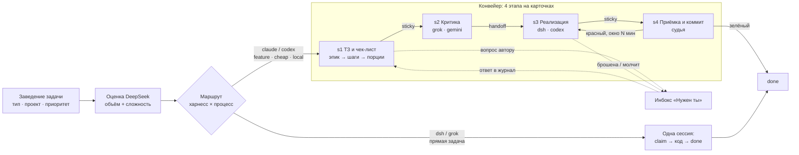

# Листик как шина между харнессами — видение

Черновик для критики, 2026-09-11. Вопрос к критику один: нужна ли такая штука вообще,
и если да — в этом ли объёме.

## Проблема

Код пишут четыре харнесса: Claude Code, dsh (DeepSeek), Codex, Grok. У каждого своя сессия,
своя память и свой способ задать вопрос. Из этого три боли:

1. **Работа теряется между сессиями.** Сессия закрылась — ТЗ, замечания критика, решения автора
   и незакоммиченный код остаются в её контексте. Следующая сессия начинает с нуля или с `ls`
   каталога спеков.
2. **Вопросы автору тонут.** Агент спрашивает в консоли; если человека нет у терминала,
   задача стоит, и никто не видит, что она стоит именно из-за вопроса.
3. **Нет общей картины.** Что в работе, кто держит, кто замолчал, что можно брать прямо сейчас,
   что ждёт другую задачу — по всем проектам сразу этого не видно нигде.

Beads решал трекинг внутри одного репозитория и не знал ни про этапы, ни про харнессы.

## Что такое Листик

Один сервер, одна база SQLite, один API с CLI и MCP. Внутри — задачи всех проектов, гибридный
поиск (полнотекст + векторы) как долговременная память, и доска.

Ключевое решение: **Листик — единственная очередь и память между харнессами.** Любая сессия,
интерактивная или запущенная диспетчером, работает одинаково:

```
ready --harness X → claim → работа + heartbeat → stage | needs-owner | done
```

Единица работы — карточка-порция. Этапы конвейера `s1-spec → s2-review → s3-impl → s4-judge → done`
живут на карточке, держатель и heartbeat — тоже. Заблокированность вычисляется по графу связей,
а не проставляется руками.

## Как проходит работа



Три конвейера отличаются только тем, кто исполняет этапы:

| Процесс | ТЗ и критика | Код | Приёмка | Когда |
| --- | --- | --- | --- | --- |
| feature-pipeline | сессия claude или codex, критика внешняя | dsh, запасной codex | судья в той же сессии, что и код | основной путь для фич |
| cheap-pipeline | Opus пишет, Gemini критикует | dsh | Sonnet | когда важен счёт за токены |
| local-pipeline | всё на моделях Claude в субагентах | Sonnet | Opus | когда автор хочет отвечать на вопросы по ходу |
| прямая задача | нет | dsh или grok | нет | мелкая правка без процесса |

Переходы двух типов. **Sticky** — этапы идут в одной сессии, держатель остаётся: s1→s2, потому что
решения автора по замечаниям критика возвращаются живому автору ТЗ; s3→s4, потому что код к приёмке
не закоммичен и живёт в рабочем дереве сессии. **Handoff** — держатель снят, задача в `ready`,
берёт любой разрешённый харнесс: s2→s3 и s4→done. Красный вердикт возвращает порцию на s3 тому же
держателю с окном ожидания; окно истекло — release и холодный старт.

## Роли

- **Человек** работает из инбокса «Нужен ты»: отвечает на вопросы, освобождает брошенное,
  решает, куда отдать задачу. Доска для наблюдения, не для перетаскивания: этап меняет агент
  через `stage`.
- **Диспетчер** — скрипт, не нейронка: фильтр `ready` по харнессу и приоритету, `claim`, запуск.
- **Харнессы** — одинаковый протокол, разные исполнители. Таблица «этап → допустимые харнессы»
  живёт на проекте.
- **Оценщик** — запрос к DeepSeek при заведении: объём S–XL и когнитивная сложность, из них
  совет «харнесс · процесс». Человек может согласиться или выбрать сам.

## Что это даёт

- **Тест холодного старта.** Перед handoff в карточке лежит всё: `spec_path`, чек-лист,
  `worktree`/`branch`, журнал, вердикт. Принимающий начинает с `listik show <id>` и ничего больше.
- **Параллель на данных, а не на словах.** Независимость порций — граф `blocks`, `ready` отдаёт
  то, что никого не ждёт. Автор ТЗ перестаёт объявлять независимость словами.
- **Здоровье видно.** Heartbeat и время на этапе дают четыре состояния: healthy, at-risk, dead,
  unknown. Брошенное поднимается в инбокс само через 24 часа.
- **Одна память.** Поиск по всем задачам и решениям всех проектов; результат закрытой задачи
  через месяц находится по одной строке.
- **Маршрутизация по цене.** Дорогая модель только там, где нужны решения; код и критика —
  у дешёвых харнессов.

## Чего Листик не делает

Не заменяет трекер для команды людей. Не считает квоты подписок. Не переносит ответ с доски
в живую интерактивную сессию Claude Code: хуков на `AskUserQuestion` нет, ответ уходит в журнал.
Не даёт кросс-колоночного drag-and-drop как способа управления.

## Что нужно построить

Сервер: тип перехода на этапе с настройкой на проекте; таблица маршрутизации и `ready?harness=`;
окно ожидания для красного вердикта и вопроса автору; лок на пару репозиторий + worktree;
поля `harness`, `skill` и сохранённая оценка на карточке; отметка «ведётся конвейером».

Вокруг: крон-диспетчер; общий скил-протокол рабочего с обёртками под claude, dsh, codex, grok;
вход в скилы конвейера «по id карточки»; окно заведения задачи с оценщиком; доска по этапам
с инбоксом и здоровьем.

## Вопросы критику

1. Нужна ли шина, или хватит файлов в `docs/specs` и git? Что именно ломается без общей очереди?
2. Четыре этапа на каждую порцию — не слишком ли дорого для задач меньше L? Где порог, ниже
   которого прямая задача всегда лучше?
3. Sticky прячет состояние в сессии. Это честная плата за возобновление субагентов или запах?
4. Оценщик на DeepSeek: реально ли он выбирает лучше человека, или это лишний вызов на каждое
   заведение?
5. Чем измерить, что это работает: время цикла порции, доля красных вердиктов, вопросов на задачу,
   брошенных задач в неделю?
