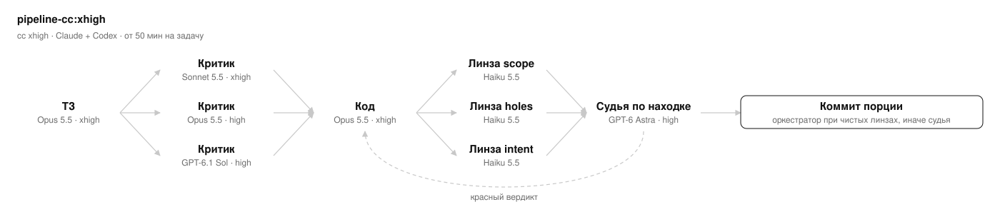
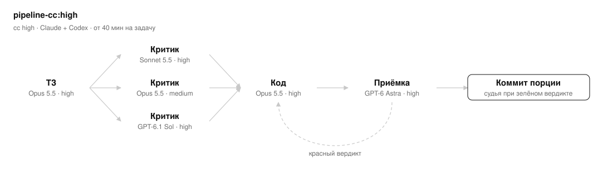
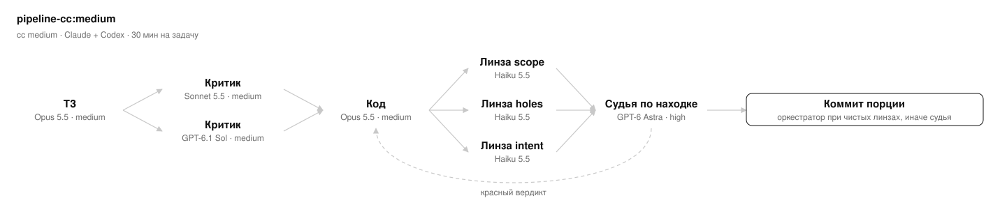
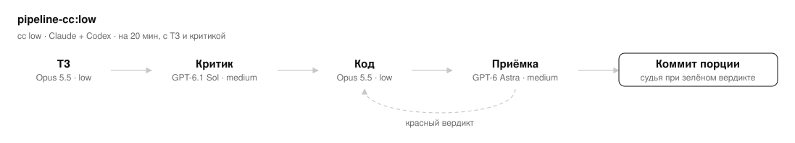
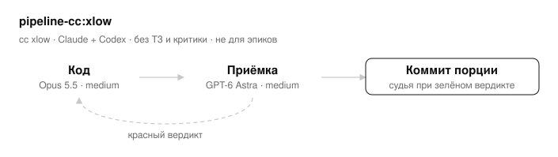

# pipeline-cc

Линейка пресетов конвейера ТЗ → критика → код → приёмка, где работают только Claude (локальные субагенты
основной сессии) и Codex (OpenAI, через скил `codex:codex-delegate`). Пресеты вызываются как
`/pipeline-cc:<пресет>` или маршрутом карточки Listik `process:cc-<пресет>`: имя запуска `/pipeline-cc:<уровень>`,
ключ маршрута `cc-<уровень>`.

Нужны харнессы Claude Code и Codex CLI и подписки Claude и OpenAI.

Плагин ничего не копирует: общий протокол — ядро `plugins/pipeline-core/references/pipeline-core.md`,
писатели ТЗ, исполнители и критики — агенты `pipeline-core:*`, внешние прогоны — скилы
`codex:*`, карточка и журнал — `listik:listik`. Своих агентов у плагина нет: критики `pipeline-core:pipeline-critic-xhigh`
и `pipeline-core:pipeline-critic-medium` (Sonnet по умолчанию, модель задаётся параметром `model` в вызове) и
исполнитель `pipeline-core:pipeline-implementer-low` (Opus low, `model` в вызове не передаётся) тоже живут в
`pipeline-core`. Поэтому ставится только вместе с тремя плагинами того же маркетплейса:

```
/plugin marketplace add dmitry-fomin/listik
/plugin install listik@listik
/plugin install pipeline-core@listik
/plugin install codex@listik
/plugin install pipeline-cc@listik
```

Нет хотя бы одного из этих плагинов — пресет останавливается до первого действия (раздел «Внешние скилы» ядра).

## Скилы

Все — `pipeline-cc:<имя>`. «—» — этапа нет. Маршруты Listik этих пресетов — `cc-<имя>` (`cc-xhigh` … `cc-xlow`); команда маршрута зовёт `/pipeline-cc:<имя>`.

| Скил | ТЗ | Критика ТЗ | Код | Приёмка |
| --- | --- | --- | --- | --- |
| `xhigh` | Opus 5.5 xhigh | Sonnet 5.5 xhigh, Opus 5.5 high, GPT-6.1 Sol high; кворум — Sonnet и Sol, Opus в кворум не входит | Opus 5.5 xhigh | линзы Haiku 5.5 max ×3; при находке — GPT-6 Astra high в Codex, коммитит судья; при чистых линзах коммитит оркестратор |
| `high` | Opus 5.5 high | Sonnet 5.5 high, Opus 5.5 medium, GPT-6.1 Sol high; кворум — Sonnet и Sol, Opus в кворум не входит | Opus 5.5 high | линзы Haiku 5.5 max ×3; при находке — GPT-6 Astra high в Codex, коммитит судья; при чистых линзах коммитит оркестратор |
| `medium` | Opus 5.5 medium | Sonnet 5.5 medium, GPT-6.1 Sol medium; кворум — оба | Opus 5.5 medium | линзы Haiku 5.5 max ×3; при находке — GPT-6 Astra high в Codex, коммитит судья; при чистых линзах коммитит оркестратор |
| `low` | Opus 5.5 low | GPT-6.1 Sol medium; кворум — он один | Opus 5.5 low | линзы Haiku 5.5 max ×3; при находке — GPT-6 Astra medium в Codex, коммитит судья; при чистых линзах коммитит оркестратор |
| `xlow` | — | — | Opus 5.5 medium (два хода) | GPT-6 Astra medium в Codex, коммитит судья |

xhigh и high — расклад автора 07.10.2026, medium — выведен по аналогии и утверждён автором.
low и xlow утверждены автором 07.10.2026 — код пишет Opus (low у low, medium у xlow), судья — Codex Astra medium.

Агенты, хук автоодобрения и ядро `pipeline-core.md` — в плагине `pipeline-core` (`plugins/pipeline-core/README.md`).

## Обоснование: Hal

Метрика — `omniscienceHallucinationRate` Artificial Analysis (AA-Omniscience hallucination rate, меньше —
лучше). Для моделей Anthropic и GPT-6 Astra — снимок `plugins/pipeline-core/references/models.json` от
2026-09-29 (поле `fetched`; 2026-09-22 — дата релиза Opus 5.5 в нём, а не снимка); для GPT-6.1 Sol — живая страница AA, снято 2026-10-07 (тех же цифр раздел «… —
проверяющие от OpenAI» в `plugins/pipeline-core/references/ROLES.md`).

| Модель (slug AA) | Роль | Hal |
| --- | --- | --- |
| `claude-opus-5-5-xhigh` | xhigh: ТЗ, код | 0.657 |
| `claude-opus-5-5-high` | high: ТЗ, код; xhigh: критик `opus` | 0.676 |
| `claude-opus-5-5-medium` | medium: ТЗ, код; high: критик `opus`; xlow: код | 0.684 |
| `claude-opus-5-5-low` | low: ТЗ, код | 0.676 |
| `claude-sonnet-5-5-xhigh` | xhigh: критик `sonnet` | 0.629 |
| `claude-sonnet-5-5-high` | high: критик `sonnet` | 0.646 |
| `claude-sonnet-5-5-medium` | medium: критик `sonnet` | 0.512 |
| `gpt-6-1-sol-high` | xhigh, high: критик `codex` | 0.494 |
| `gpt-6-1-sol-medium` | medium, low: критик `codex` | 0.516 |
| `gpt-6-astra-high` | xhigh, high, medium: судья | 0.448 |
| `gpt-6-astra-medium` | low, xlow: судья | 0.465 |

## Схемы

### pipeline-cc:xhigh



Когда брать: Claude + Codex · от 50 мин на задачу

### pipeline-cc:high



Когда брать: Claude + Codex · от 40 мин на задачу

### pipeline-cc:medium



Когда брать: Claude + Codex · 30 мин на задачу

### pipeline-cc:low



Когда брать: Claude + Codex · на 20 мин, с ТЗ и критикой

### pipeline-cc:xlow



Когда брать: Claude + Codex · без ТЗ и критики · не для эпиков
