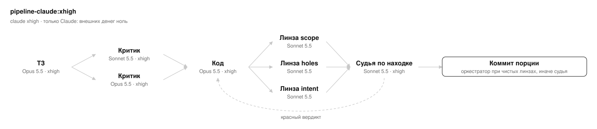
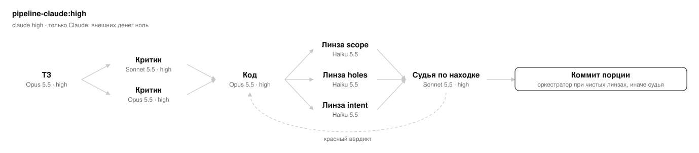

# pipeline-claude

Пресеты конвейера реализации задачи, где работает только Claude — локальные субагенты основной сессии, без
внешних харнессов. Каждый скил запускается только по явному имени — маршрутом карточки Listik (`launch_route` или
метка `process:<ключ>`) или когда человек назвал пресет: имя запуска `/pipeline-claude:<уровень>`, ключ маршрута
`claude-<уровень>`.

Нужны только харнесс Claude Code и подписка Claude.

Установка — сам плагин и все плагины, которые зовут его пресеты:

```
/plugin marketplace add dmitry-fomin/listik
/plugin install listik@listik
/plugin install pipeline-core@listik
/plugin install pipeline-claude@listik
```

Нет хотя бы одного из этих плагинов — пресет останавливается до первого действия (раздел «Внешние скилы» ядра).

## Скилы

Все — `pipeline-claude:<имя>`. «—» — этапа нет.

| Скил | Когда брать | ТЗ | Критика ТЗ | Код | Приёмка + коммит |
| --- | --- | --- | --- | --- | --- |
| `xhigh` | то же, что `high`, на усилии xhigh; $0 внешних | Opus 5.5 xhigh (`pipeline-spec-writer-xhigh`, `model: opus`) | Sonnet 5.5 xhigh + Opus 5.5 xhigh (`pipeline-critic-xhigh`), кворум — оба | Opus 5.5 xhigh (`pipeline-implementer-xhigh`, `model: opus`) | линзы Sonnet 5.5 xhigh ×3 (`pipeline-lens-xhigh`), при находке — Sonnet 5.5 xhigh (`pipeline-judge-xhigh`) |
| `high` | только Claude Code, без внешних харнессов; $0 внешних, усилие ролей — high из их агентов | Opus 5.5 high (`pipeline-spec-writer`, `model: opus`) | Sonnet 5.5 high + Opus 5.5 high (`pipeline-critic`), кворум — оба | Opus 5.5 high (`pipeline-implementer-high`, `model: opus`) | линзы Sonnet 5.5 high ×3 (`pipeline-lens`), при находке — Sonnet 5.5 high (`pipeline-judge`) |

Агенты, хук автоодобрения и ядро `pipeline-core.md` — в плагине `pipeline-core` (`plugins/pipeline-core/README.md`).

## Схемы

### pipeline-claude:xhigh



Когда брать: только Claude: внешних денег ноль

### pipeline-claude:high



Когда брать: только Claude: внешних денег ноль
