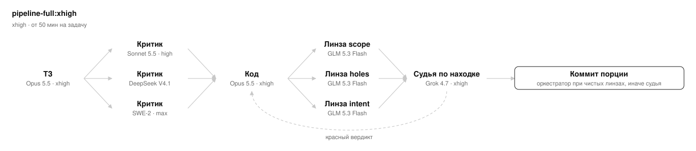
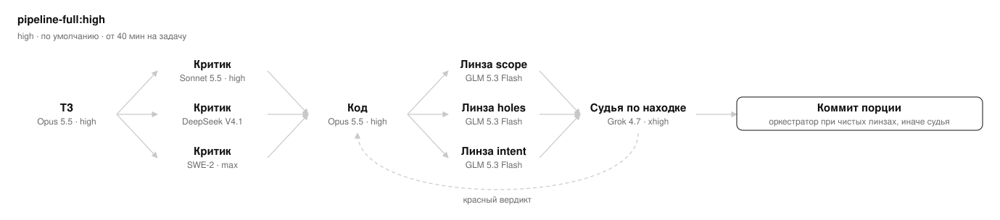
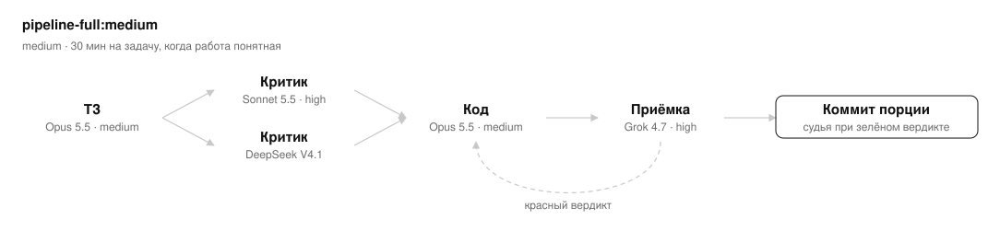
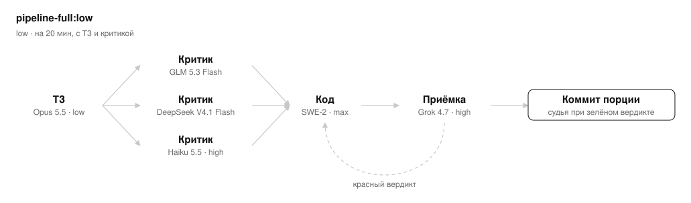
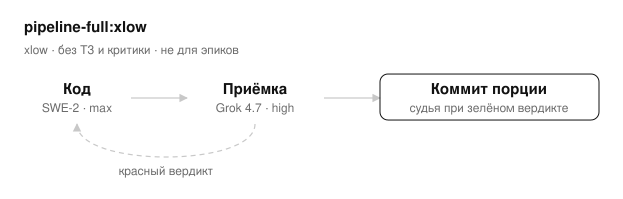
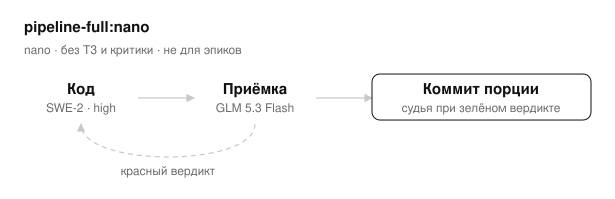
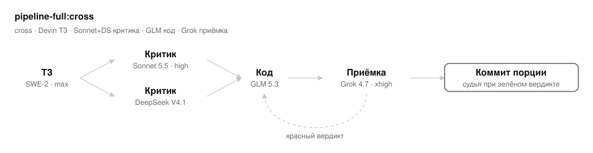

# pipeline-full

Пресеты конвейера реализации задачи: ТЗ → критика ТЗ → код → приёмка с коммитом. Основной контекст
только маршрутизирует, носит вопросы автору и ведёт журнал; код пишет исполнитель, коммитит судья
(в `pipeline-full:xhigh`, `pipeline-full:high`, `pipeline-full:medium` и `pipeline-full:cross` при чистых линзах приёмки порцию коммитит оркестратор).
Каждый скил запускается только по явному имени — маршрутом карточки Listik (`launch_route` или
метка `process:<ключ>`) или когда человек назвал пресет: имя запуска `/pipeline-full:<уровень>`, ключ маршрута
`full-<уровень>`.

Нужны харнессы Claude Code, Grok CLI, devin и pi и подписки на нейронки Claude, Grok, Devin (SWE), GLM и DeepSeek.

Установка — сам плагин и все плагины, которые зовут его пресеты:

```
/plugin marketplace add dmitry-fomin/listik
/plugin install listik@listik
/plugin install pipeline-core@listik
/plugin install pi@listik
/plugin install devin@listik
/plugin marketplace add dashpot4/grok-plugin-for-claude
/plugin install grok@grok-build
/plugin install pipeline-full@listik
```

Нет хотя бы одного из этих плагинов — пресет останавливается до первого действия (раздел «Внешние скилы» ядра).

## Скилы

Все — `pipeline-full:<имя>`. «—» — этапа нет.

| Скил | Когда брать | ТЗ | Критика ТЗ | Код | Приёмка + коммит |
| --- | --- | --- | --- | --- | --- |
| `xhigh` | ошибка дороже прогона; ~$4 на задачу | Opus 5.5 xhigh (`pipeline-spec-writer-xhigh`, `model: opus`) | Sonnet 5.5 high (`pipeline-critic`, `model: sonnet`) + DeepSeek V4.1 Flash и GLM 5.3 Flash в pi, кворум, сводит оркестратор | Opus 5.5 xhigh (`pipeline-implementer-xhigh`) | линзы Haiku 5.5 max ×3 (`pipeline-lens`, `model: haiku`), при находке — Grok 4.7 xhigh |
| `high` | расклад по умолчанию; ~$4 | Opus 5.5 high (`pipeline-spec-writer`, `model: opus`) | Sonnet 5.5 high (`pipeline-critic`, `model: sonnet`) + DeepSeek V4.1 Flash и GLM 5.3 Flash в pi, кворум, сводит оркестратор | Opus 5.5 high (`pipeline-implementer-high`, `model: opus`) | линзы Haiku 5.5 max ×3 (`pipeline-lens`, `model: haiku`), при находке — Grok 4.7 xhigh |
| `medium` | работа понятная, хватит пониженного усилия; ~$3 | Opus 5.5 medium (`pipeline-spec-writer-medium`, `model: opus`) | Sonnet 5.5 high (`pipeline-critic`, `model: sonnet`) + DeepSeek V4.1 Flash в pi, кворум, сводит оркестратор | Opus 5.5 medium (`pipeline-implementer`, `model: opus`) | линзы Haiku 5.5 max ×3 (`pipeline-lens`, `model: haiku`), при находке — Grok 4.7 high |
| `low` | поджимает лимит Max: код вне квоты; ~$3 | Opus 5.5 low (`pipeline-spec-writer-low`, `model: opus`) | DeepSeek V4.1 Flash + GLM 5.3 Flash в pi + Haiku 5.5 high (`pipeline-critic`, `model: haiku`), кворум, сводит оркестратор | devin SWE-2 max (`devin:devin-delegate --thinking max`) | Grok 4.7 high |
| `xlow` | задача в один прогон, нужна независимая приёмка | — | — | devin SWE-2 max (`devin:devin-delegate --thinking max`) | Grok 4.7 high |
| `nano` | то же, дешевле; при пустом `write_scope` сперва ход на чтении за границами правки | — | — | devin SWE-2 high (`devin:devin-delegate --thinking high`) | GLM 5.3 Flash (`pi:pi-delegate --channel glm`) |
| `cross` | автор ТЗ и исполнитель на разных вендорах: Devin пишет ТЗ, GLM в pi — код | Devin (SWE-2, max) | DeepSeek V4.1 Flash в pi + Sonnet 5.5 high (`pipeline-critic`, `model: sonnet`), кворум, сводит оркестратор | GLM 5.3 Flash в pi | линзы Haiku 5.5 max ×3 (`pipeline-lens`, `model: haiku`), при находке — Grok 4.7 xhigh |

Агенты, хук автоодобрения и ядро `pipeline-core.md` — в плагине `pipeline-core` (`plugins/pipeline-core/README.md`).

## Схемы

### pipeline-full:xhigh



Когда брать: от 50 мин на задачу

### pipeline-full:high



Когда брать: от 40 мин на задачу

### pipeline-full:medium



Когда брать: 30 мин на задачу, когда работа понятная

### pipeline-full:low



Когда брать: на 20 мин, с ТЗ и критикой

### pipeline-full:xlow



Когда брать: без ТЗ и критики · не для эпиков

### pipeline-full:nano



Когда брать: без ТЗ и критики · не для эпиков

### pipeline-full:cross



Когда брать: Devin ТЗ · Sonnet+DS критика · GLM код · Grok приёмка
